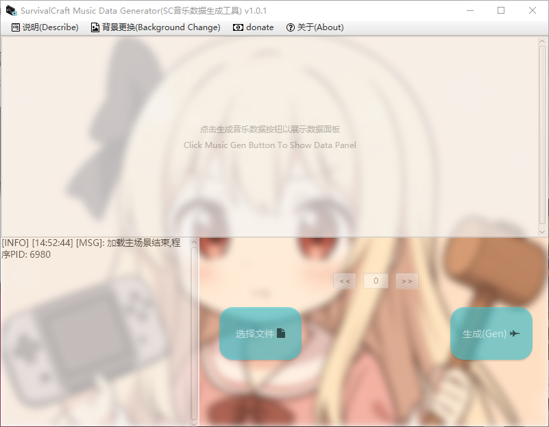
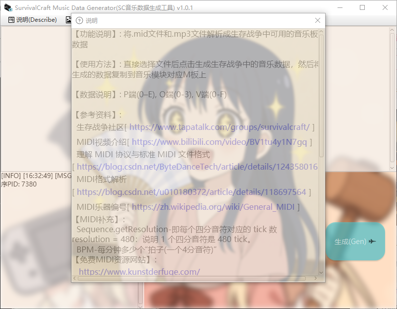
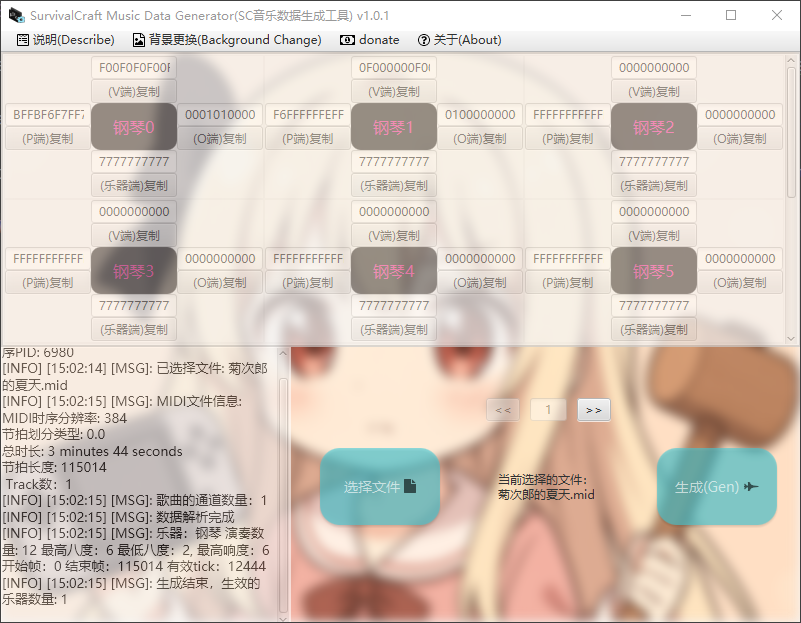

<h1 align="center">SurvivalCraft Music Data Generator</h1> 

English|[中文](./doc/中文.md)

# SCMusicGenerator(SurvivalCraft Music Data Generator)

The tool is designed to convert MIDI files into music data usable in Survivalcraft. It tells you how many music plates you’ll need and, for each plate, provides the required parameters—volume, octave, instrument code, and pitch data.

Usage is very simple: load your MIDI file into the tool and click “Generate.” If you start with an MP3, first convert it to MIDI before running the generator.

Note that the tool only produces the data; the actual playback timing is determined by the pulse timing of your music circuit.

# Tool interface

1. Main Interface
   

2. Describe Interface
   

3. After Generator
   
