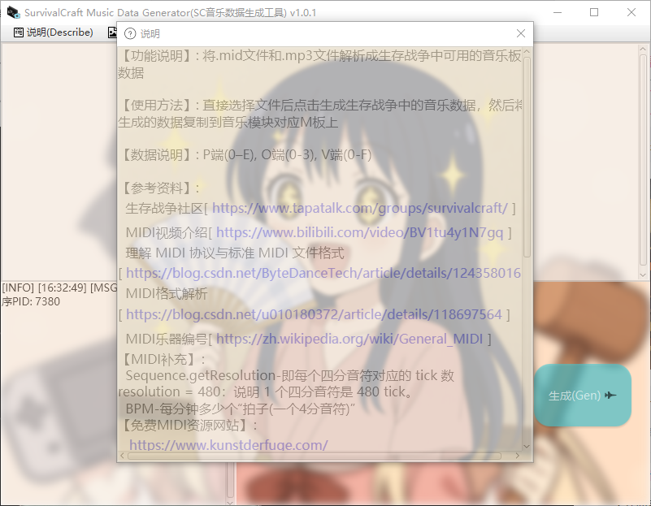
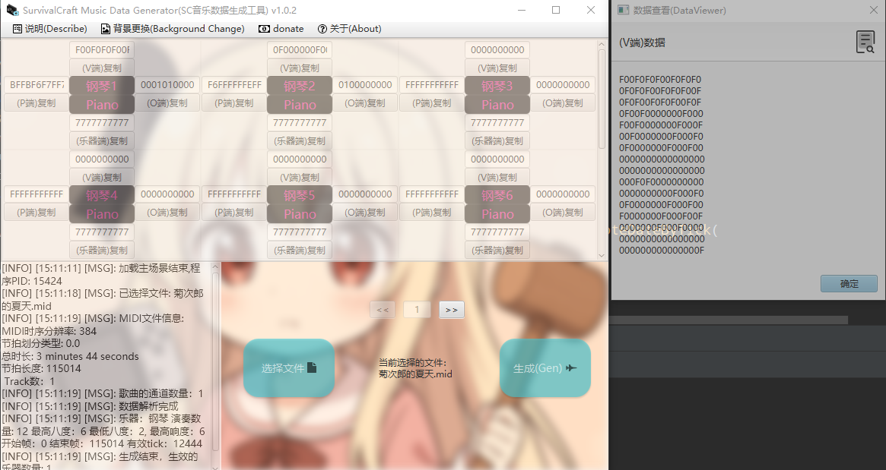

<h1 align="center">生存战争音乐数据生成器</h1> 

# SCMusicGenerator(SurvivalCraft Music Data Generator)

工具主要用于将MIDI文件生成生存战争可用的音乐数据，这款工具将告诉你需要多少个音乐板，以及每个音乐板所需要的音乐数据，
例如响度，八度，乐器代码以及音高数据。

使用方法也非常简单，将你的MIDI数据放到工具中，然后点击生成即可。注意如果是MP3文件，需要在选择文件后先将文件转为MIDI文件再进行数据生成

当然工具只支持生成数据，实际的播放节奏取决于你的音乐电路脉冲时间

# 工具界面

1. 主界面(Main Window)
   
2. 说明
   
3. 生成成功后
    
